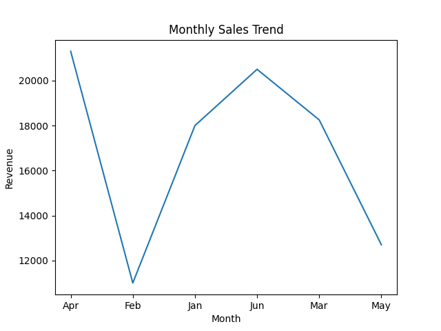
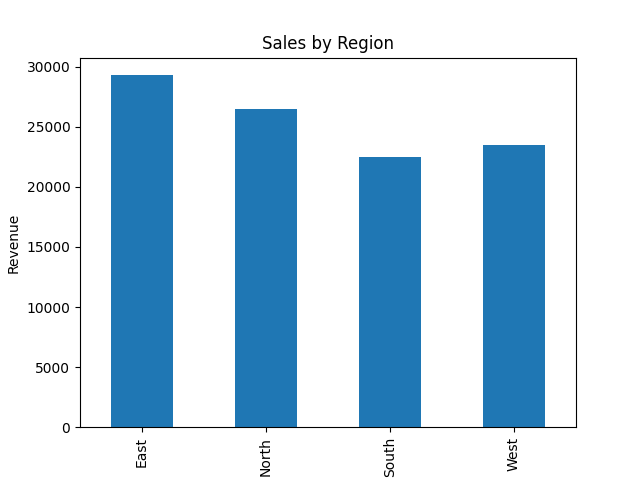
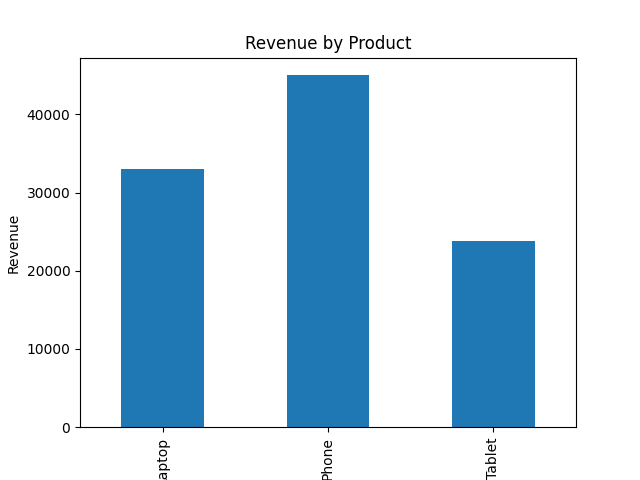
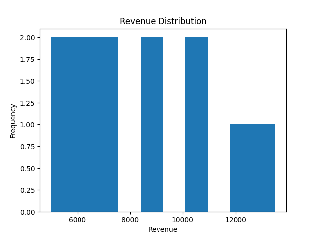
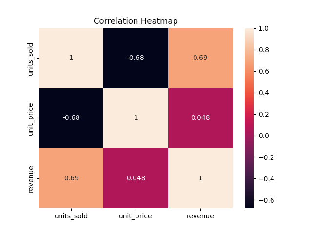

# 📊 Sales Performance Data Visualization Project

## 📌 Project Overview

This project focuses on transforming raw sales data into meaningful visual insights using Python data visualization tools. The goal is to analyze sales performance across **time, regions, and products** to support data-driven business decisions.

The project demonstrates strong skills in **data analysis, visualization, and storytelling**, making it suitable for a professional data analytics portfolio.

---

## 🎯 Objectives

* Analyze sales trends over time
* Compare revenue performance across regions
* Evaluate product-level revenue contribution
* Identify patterns and correlations in sales data
* Create clear and impactful visualizations

---

## 🛠 Tools & Technologies

* **Python**
* **Pandas** – data manipulation
* **Matplotlib** – foundational plotting
* **Seaborn** – statistical visualizations

---

## 📈 Visualizations & Insights

### 📅 Monthly Sales Trend



**Insight:**
Sales revenue shows noticeable variation across months, indicating potential seasonality. This insight can help businesses plan inventory and marketing strategies around peak sales periods.

---

### 🌍 Sales by Region



**Insight:**
Some regions outperform others in total revenue, suggesting stronger market demand. Management can prioritize high-performing regions while investigating growth opportunities in weaker regions.

---

### 📦 Revenue by Product



**Insight:**
Certain products contribute significantly more to overall revenue. This information is useful for pricing strategies, promotions, and resource allocation.

---

### 💰 Revenue Distribution



**Insight:**
Most sales transactions fall within a moderate revenue range, with fewer high-revenue outliers. This indicates relatively stable pricing and purchasing behavior.

---

### 🔥 Correlation Heatmap



**Insight:**
Revenue has a strong positive correlation with units sold, confirming that sales volume is a major driver of revenue. Unit price shows less variation, suggesting consistent pricing.

---

## ▶️ How to Run the Project

1. Clone the repository
2. Install dependencies:

   ```bash
   pip install -r requirements.txt
   ```
3. Run the visualization script:

   ```bash
   python src/sales_visualization.py
   ```
4. Generated visualizations will be saved in the **visualizations/** folder.

---

## 🎯 Key Takeaways

* Data visualization simplifies complex datasets
* Visual insights enable faster and better business decisions
* Proper chart selection improves clarity and impact
* This project demonstrates practical, job-ready data analytics skills

---